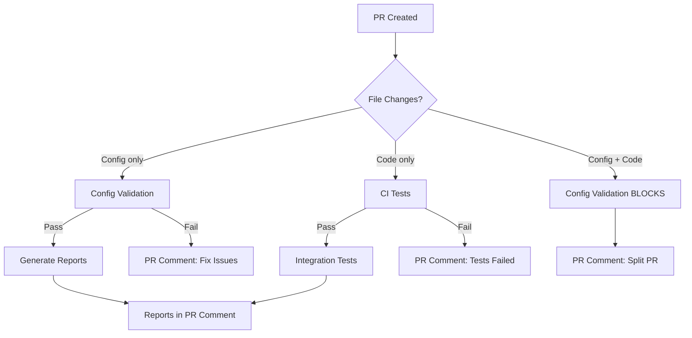

# GitHub Workflows

ImpactLens uses 3 automated workflows for CI/CD, security, and report generation.

## Quick Reference

| Workflow | Trigger | Purpose | Duration |
|----------|---------|---------|----------|
| **[CI](#ci)** | Code PRs, push to master | Tests, lint, type check | ~1 min |
| **[Config Validation](#config-validation)** | Config PRs | Security validation, block mixed PRs | ~30s |
| **[Generate Reports](#generate-reports)** | Config PRs (approved) | Auto-generate metrics reports | ~3-5 min |

## Workflows

### CI

**File:** `.github/workflows/ci.yml`

**Runs on:**
- Push to `master`
- Pull requests (code changes)

**What it does:**
1. **Smart skip logic:**
   - User config-only PRs (`config/my-team/*.yaml`) → Skip tests ✅
   - Docs-only PRs → Skip tests ✅
   - **Test config PRs** (`config/test-*-ci/**/*.yaml`) → **Run integration tests** ✅
   - Code changes → Run full CI ✅

2. **Test matrix:** Python 3.11, 3.12, 3.13
3. **Lint & type check:** Python 3.11 only
4. **Integration tests:** Full pipeline test with real API calls

**Jobs:**
- `test` - Unit tests, lint, type checking
- `integration-test` - End-to-end pipeline validation

**When to expect:**
- ✅ Code PRs: Full CI runs
- ✅ Test config PRs (`config/test-*-ci/**`): Integration tests run
- ⏭️ User config PRs (`config/my-team/**`): Skipped (validated separately)
- ⏭️ Docs PRs: Skipped

---

### Config Validation

**File:** `.github/workflows/config-validation.yml`

**Runs on:**
- Pull requests targeting `master` (any file changes)

**What it does:**
1. **Categorize PR:**
   - Config-only → Validate and allow ✅
   - Code-only → Allow (no action needed) ✅
   - **Mixed (config + code)** → **BLOCK** ❌

2. **Security validation** (config-only PRs):
   - Command injection detection
   - Path traversal prevention
   - Hardcoded secret detection
   - YAML structure validation

**Why block mixed PRs?**

Config-only PRs can access repository secrets. Mixing code changes would allow malicious code execution with secret access.

**Resolution:**
Split mixed PRs into:
1. Config-only PR
2. Code-only PR

---

### Generate Reports

**File:** `.github/workflows/generate-reports.yml`

**Runs on:**
- Config file changes in PRs
- Manual trigger via `workflow_dispatch`

**What it does:**
1. **Detect config mode:**
   - Single team → Generate team + combined reports
   - Multi-team → Generate team + combined + aggregated reports

2. **Generate reports:**
   - Jira metrics (if `jira_report_config.yaml`)
   - PR metrics (if `pr_report_config.yaml`)
   - Aggregated (if `aggregation_config.yaml`)

3. **Upload & share:**
   - Auto-upload to Google Sheets (anonymized)
   - Post summary as PR comment
   - Upload artifacts (raw reports)

**Requirements:**
- Repository secrets configured
- Config files validated (no security issues)

**Event:** `pull_request_target` (allows fork PRs to access secrets)

---

## Workflow Interaction



## Security Model

### Config-Only PRs (with secrets access)
- ✅ Can access `JIRA_API_TOKEN`, `GOOGLE_CREDENTIALS`
- ✅ Can generate reports
- ❌ **Cannot modify code** (security boundary)

### Code-Only PRs (no secrets access)
- ✅ Run full CI tests
- ✅ Can modify any code
- ❌ Cannot access report generation secrets

### Why separate?
Without this separation, a malicious PR could:
1. Add config file (to trigger report generation)
2. Modify Python code to steal secrets
3. Submit PR → Secrets stolen automatically

With separation:
- Config PRs validated (no code execution)
- Code PRs tested (no secret access)

---

## Common Scenarios

### Scenario 1: Submit config for report generation

```bash
# 1. Create config
mkdir -p config/my-team
cp config/*_config.yaml.example config/my-team/

# 2. Edit configs (team members, phases, etc.)
vim config/my-team/jira_report_config.yaml

# 3. Submit PR (config files only!)
git checkout -b report/my-team
git add -f config/my-team/
git commit -m "chore: generate reports for my-team"
git push origin report/my-team
```

**What happens:**
1. ✅ Config Validation runs → Validates security
2. ⏭️ CI skipped (config-only PR)
3. ✅ Generate Reports runs → Creates metrics
4. 📊 Reports posted as PR comment

### Scenario 2: Fix a bug in Python code

```bash
# Fix bug in metrics calculation
vim impactlens/core/jira_metrics_calculator.py

# Submit PR
git checkout -b fix/jira-metrics-bug
git add impactlens/core/jira_metrics_calculator.py
git commit -m "fix: correct average calculation in jira metrics"
git push origin fix/jira-metrics-bug
```

**What happens:**
1. ✅ CI runs → Tests, lint, type check
2. ✅ Integration tests run
3. ✅ Config Validation allows (no config files)
4. ⏭️ Generate Reports skipped (no config changes)

### Scenario 3: Accidentally mix config + code ❌

```bash
# Add config + modify code
git add config/my-team/ impactlens/cli.py
git commit -m "Add team config and update CLI"
git push
```

**What happens:**
1. ❌ Config Validation **BLOCKS** PR
2. 💬 PR comment explains: "Split into 2 PRs"
3. 🚫 Cannot merge until fixed

**Fix:**
```bash
# Split into 2 PRs
git reset HEAD~1

# PR 1: Config only
git add config/my-team/
git commit -m "chore: add my-team config"
git push origin config/my-team

# PR 2: Code only
git add impactlens/cli.py
git commit -m "feat: update CLI"
git push origin update-cli
```

---

## Maintenance

### Adding new workflow

1. Create `.github/workflows/new-workflow.yml`
2. Update this README
3. Test with PR

### Updating secrets

**Repository Settings → Secrets:**
- `JIRA_API_TOKEN` - Jira API access
- `GITHUB_TOKEN` - Auto-provided by GitHub
- `GOOGLE_CREDENTIALS_BASE64` - Service account JSON (base64)
- `GOOGLE_SPREADSHEET_ID` - Default sheet ID

### Debugging workflow failures

```bash
# Check workflow logs in GitHub Actions tab
# Or test locally:
bash scripts/test_workflow_locally.sh
bash scripts/test_config_enforcement.sh
```

---

## Migration Notes

### From `pull_request` to `pull_request_target`

**Change:** `generate-reports.yml` uses `pull_request_target`

**Why:** Allow fork PRs to access secrets for report generation

**Security:** Config Validation workflow prevents code execution with secret access

**Before (insecure):**
```yaml
pull_request:  # Fork PRs can't access secrets
```

**After (secure):**
```yaml
pull_request_target:  # Fork PRs CAN access secrets
# But: Config Validation blocks mixed PRs
# So: Only validated config files run with secrets
```

---

## Related Documentation

- [Configuration Guide](../../docs/CONFIGURATION.md) - How to write configs
- [Security Guide](../../scripts/validate_config.py) - Validation rules
- [Contributing Guide](../../docs/CONTRIBUTING.md) - Development workflow
